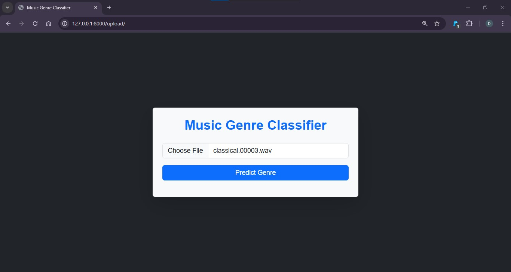
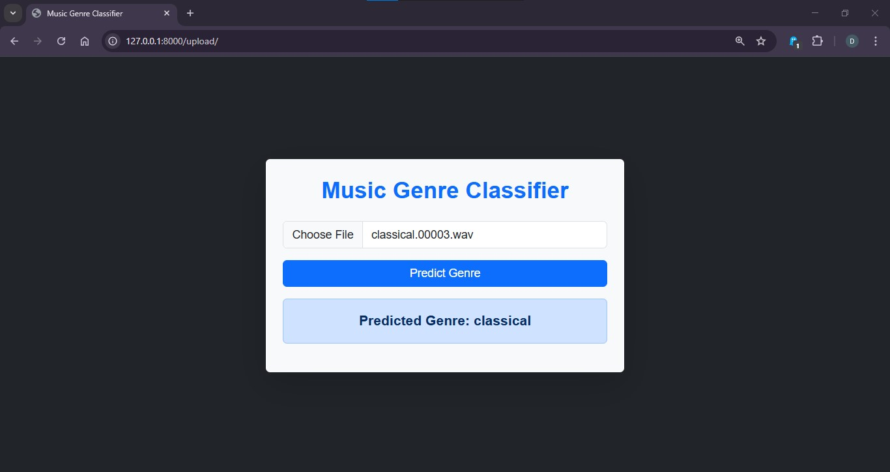

# 🎵 Music Genre Prediction Web App

A full-stack web application for predicting music genres using audio features. Built with **Django (Python)** for the backend and **HTML/CSS/JavaScript** for the frontend.

---

## 🌐 Web Interface Demo

### 🎧 Home Page



### 🎼 Prediction Result



---

## 🎤 Features

- Upload or select audio clips to classify genres
- Pre-trained ML model for real-time predictions
- Clean UI built with JavaScript, HTML & CSS
- Features extracted from 3-second and 30-second clips

---

## 📁 Project Structure

```plaintext
GENERE PREDICTION/
├── music_genre_classifier/
│   ├── classify/               # Frontend logic and static files
│   ├── music_genre_classifier/ # Django settings
│   └── temp/
├── model.pkl
├── poly.pkl
├── scaler.pkl
├── features_3_sec.csv
├── features_30_sec.csv
├── train_model.py
├── music_genre_prediction.ipynb
├── db.sqlite3
├── manage.py
├── requirements.txt
├── .gitignore
├── assets/
│   ├── homepage.png
│   └── prediction_result.png
```

---

## 🛠️ Setup Instructions (Windows)

### 1️⃣ Clone the Repository

```bash
git clone https://github.com/Devbhagat718/music-genre-prediction.git
cd music-genre-prediction
```

### 2️⃣ Create Virtual Environment & Activate

```bash
python -m venv venv
venv\Scripts\activate
```

### 3️⃣ Install Dependencies

```bash
pip install -r requirements.txt
```

### 4️⃣ Add Music Clips

Download the ZIP from the link above and extract it into the root project directory.

### 5️⃣ Apply Migrations

```bash
python manage.py migrate
```

### 6️⃣ Run the Django Server

```bash
python manage.py runserver
```

Open your browser and go to:  
📍 `http://127.0.0.1:8000/upload/`

---

## 🧠 Technologies Used

- **Backend:** Python, Django, Scikit-learn
- **Frontend:** HTML, CSS, JavaScript
- **ML Model:** Logistic Regression with Polynomial Features & Scaler

---

## 📝 .gitignore (already included)

The `.gitignore` file excludes:

```plaintext
venv/
__pycache__/
*.pyc
*.pyo
*.pyd
*.sqlite3
*.zip
*.pkl
Music Clips/
.env
.DS_Store
.ipynb_checkpoints/
```

---

## 🙌 Contribute

Found a bug or want to add features? PRs are welcome!

---

## 📝 License

This project is intended for educational and demonstration purposes.
